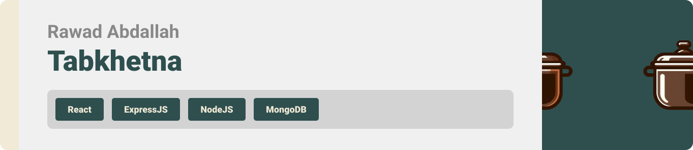

<br><br>

<!-- project philosophy -->


> Tabkhetna.
>
> A social media platform designed for food and cooking enthusiasts is a specialized online community that brings together individuals who share a common passion for all things related to food. This platform aims to create a space where users can connect, interact, and engage with others who have a similar interest in culinary arts, gastronomy, and the joy of cooking.

### User Stories

#### User

- As a user, I want to to share my recipes to everyone.
- As a user, I want to to gain more achievements to grab much more attention.
- As a user, I want to chat with others.
- As a user, I want to share my comments on other recipes.
- As a user, I want to contact for help.

<br>

<!-- Prototyping -->
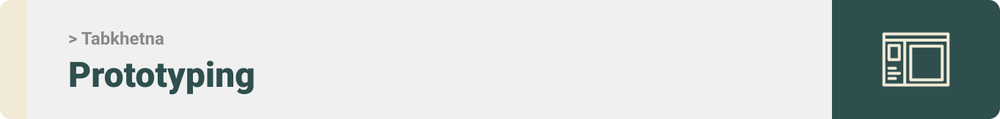

> I designed Tabkhetna using wireframes and mockups, iterating on the design until we reached the ideal layout for easy navigation and a seamless user experience, I've gone during the coding process through some changes, so it might look a bit different in the app(in a better way).

### Wireframes

| Login screen  | Register screen |  Landing screen |
| ---| ---| ---|
| 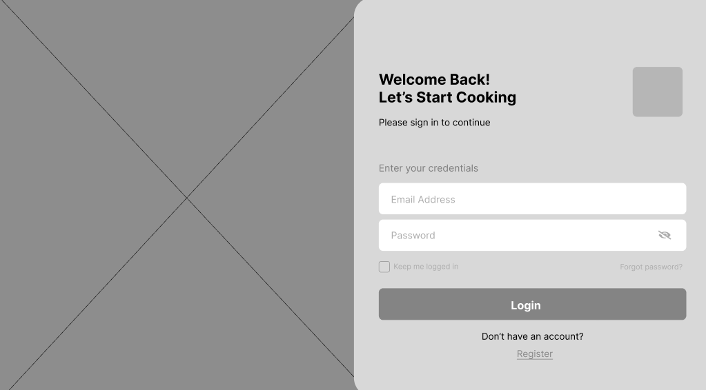 | 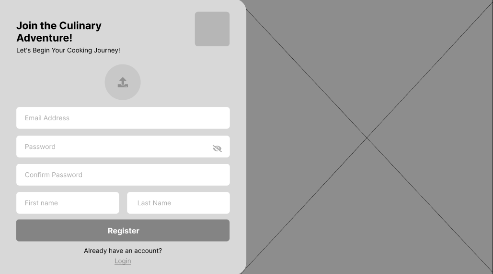 | 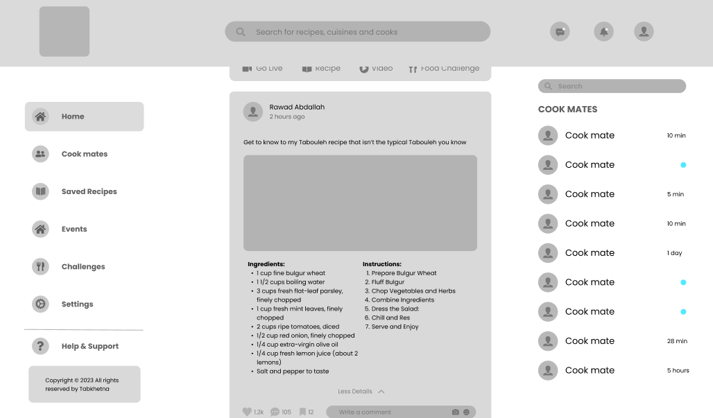 |

### Mockups

| Login Screen  | Profile Screen | Cookmates Screen |
| ---| ---| ---|
| 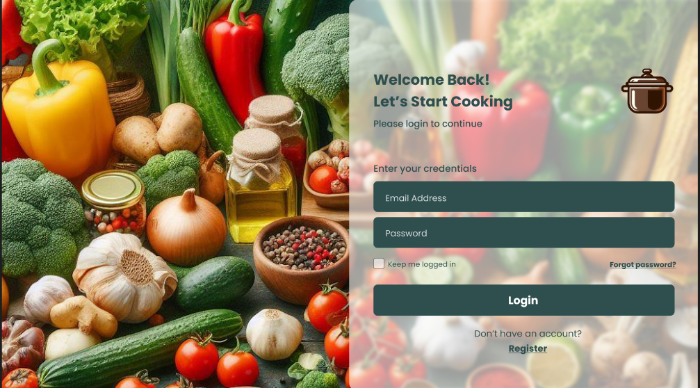 | 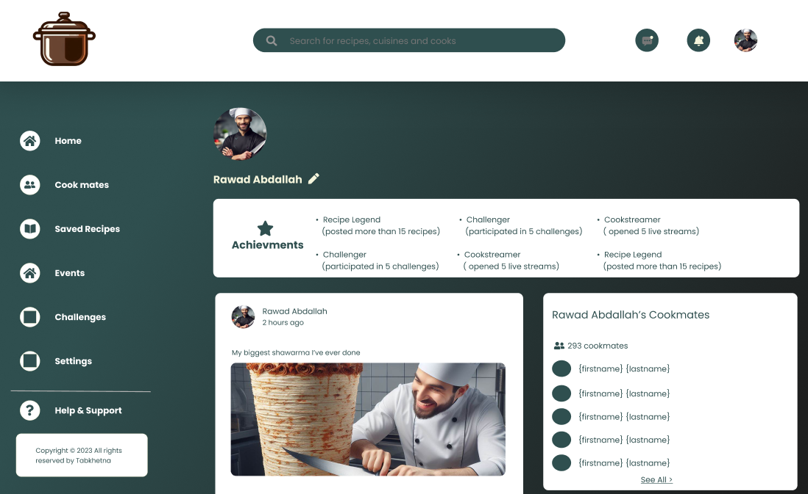 | 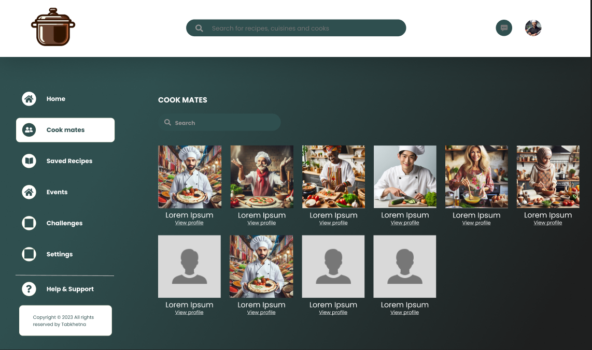 
<br><br>

<!-- Implementation -->


> Using the wireframes and mockups as a guide, we implemented the Tabkhetna app with the following features:

### User Screens (Web)

| Login & Register Screen |  AI Going in Action |
| ---| ---|
| 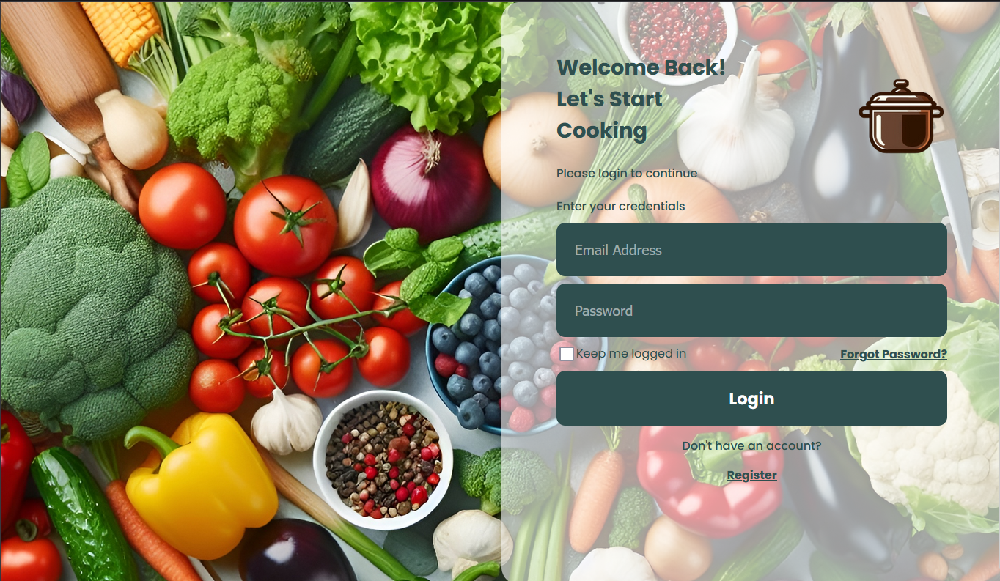 |  |
| Home screen  | Profile screen |
| 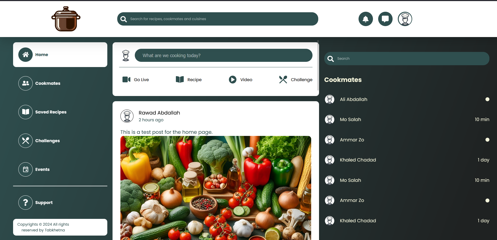 | 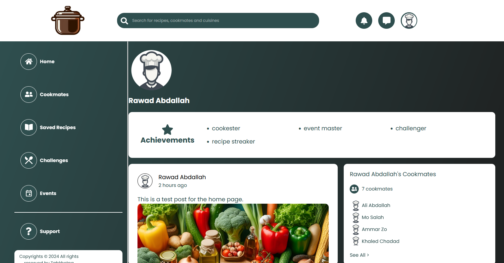 |
| Loading screen |
| 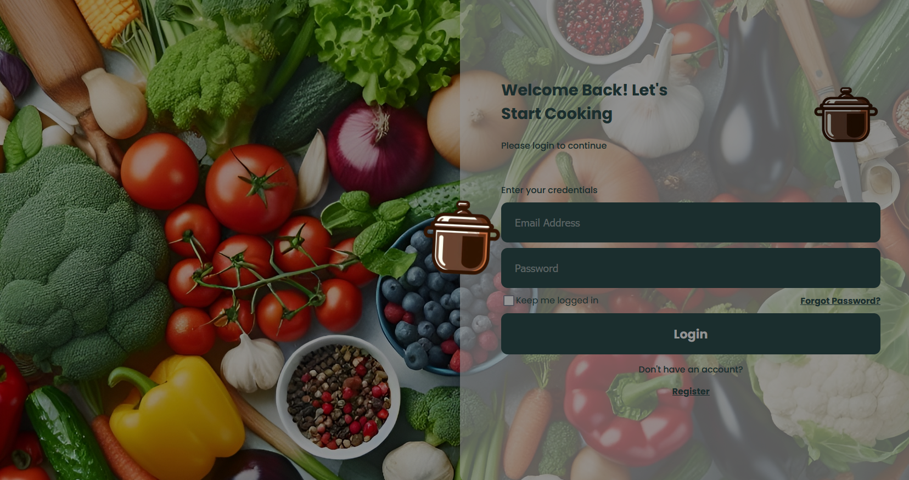 |

<br><br>

<!-- Tech stack -->
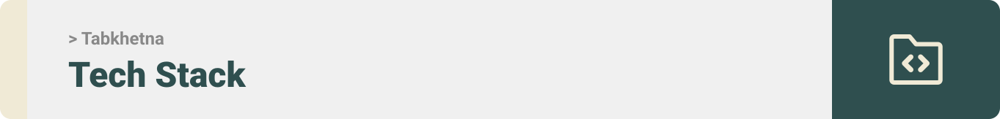

### Tabkhetna is built using the following technologies:

- This project uses the MERN stack. The MERN stack is a full-stack JavaScript solution, comprising MongoDB as the database, Express.js as the web application framework, React as the front-end library, and Node.js as the server runtime. The MERN stack enables the development of cross-platform applications with a unified codebase for mobile, desktop, and web environments.
- For persistent storage (database), the app uses the MongoDB database. MongoDB allows the app to create a custom storage schema and save it to a local database, providing a flexible and scalable solution for data management.
- The app uses the font ["Poppins"](https://fonts.google.com/specimen/Poppins) as its main font, and the design of the app adheres to the material design guidelines.

<br><br>

<!-- Prompt Engineering -->


### Crafting words for better recipes with Gemini AI

- In my project, I made sure that AI understands and respond better. By choosing words carefully, I help the AI give you the right recipe info when you use Gemini AI. It's like telling it exactly what you want, and I do that to make it work better for you.
- AI would respond with either the missing ingredients or instructions for the chosen recipe post.
<br><br>
<!-- How to run -->


> To set up Tabkhetna locally, follow these steps:

### Prerequisites

This is an example of how to list things you need to use the software and how to install them.
* npm
  ```sh
  npm install npm@latest -g
  ```

### Installation

_Below is an example of how you can instruct your audience on installing and setting up your app. This template doesn't rely on any external dependencies or services._

1. Get a free Gemini API Key at [Gemini](https://www.gemini.com/).
2. Clone the repository:

    ```bash
    git clone https://github.com/RawadAbdallah/Tabkhetna.git
    ```

3. Install NPM packages:

    ```bash
    npm install
    ```

4. Copy `.example.env` and fill in the required information.
5. Run the frontend app:
   ```bash
   npm run dev
   ```
6. Run the backend app:
   ```bash
   npm start
   ```


Now, you should be able to run Express locally and explore its features.
