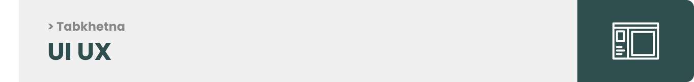

<br><br>

<!-- project philosophy -->


> Tabkhetna.
>
> A social media platform designed for food and cooking enthusiasts is a specialized online community that brings together individuals who share a common passion for all things related to food. This platform aims to create a space where users can connect, interact, and engage with others who have a similar interest in culinary arts, gastronomy, and the joy of cooking.

### User Stories

#### User

- As a user, I want to share live videos and events as a classes on the application.
- As a user, I want to to share my recipes to everyone.
- As a user, I want to participate in an events and challenges to gain more achievements to grab much more attention.
- As a user, I want to chat with others.
- As a user, I want to share my comments on other recipes.
- As a user, I want to contact the help supporters.

<br>

#### Admin

- As a admin, I can ban users who violated the rules.
- As a admin, I can approve or disapprove an event posted.
- As a admin, I can respond to support messages sent by the users.
- As a admin, I can post FAQs in the Help & Support section.

<br><br>

<!-- Prototyping -->


> I designed Tabkhetna using wireframes and mockups, iterating on the design until we reached the ideal layout for easy navigation and a seamless user experience.

### Wireframes

| Login screen  | Register screen |  Landing screen |
| ---| ---| ---|
|  |  |  |

### Mockups

| Home screen  | Menu Screen | Order Screen |
| ---| ---| ---|
|  |  |  
<br><br>

<!-- Implementation -->


> Using the wireframes and mockups as a guide, we implemented the Tabkhetna app with the following features:

### User Screens (Web)

| Login screen  | Register screen |
| ---| ---|
|  |  |
| Home screen  | Profile screen |
|  |  |
| Loading screen |
|  |

### Admin Screens (Web)

| Login screen  | Register screen |  Landing screen |
| ---| ---| ---|
|  |  |  |
| Home screen  | Menu Screen | Order Screen |
|  |  |  |

<br><br>

<!-- Tech stack -->


### Tabkhetna is built using the following technologies:

- This project uses the MERN stack. The MERN stack is a full-stack JavaScript solution, comprising MongoDB as the database, Express.js as the web application framework, React as the front-end library, and Node.js as the server runtime. The MERN stack enables the development of cross-platform applications with a unified codebase for mobile, desktop, and web environments.
- For persistent storage (database), the app uses the MongoDB database. MongoDB allows the app to create a custom storage schema and save it to a local database, providing a flexible and scalable solution for data management.
  - 🚨 Currently, notifications aren't working on macOS. This is a known issue that we are working to resolve!
- The app uses the font ["Poppins"](https://fonts.google.com/specimen/Poppins) as its main font, and the design of the app adheres to the material design guidelines.

<br><br>

<!-- How to run -->


> To set up Tabkhetna locally, follow these steps:

### Prerequisites

This is an example of how to list things you need to use the software and how to install them.
* npm
  ```sh
  npm install npm@latest -g
  ```

### Installation

_Below is an example of how you can instruct your audience on installing and setting up your app. This template doesn't rely on any external dependencies or services._

1. Get a free API Key at [https://example.com](https://example.com)
2. Clone the repo
   ```sh
   git clone https://github.com/RawadAbdallah/Tabkhetna.git
   ```
3. Install NPM packages
   ```sh
   npm install
   ```
4. Enter your API in `config.js`
   ```js
   const API_KEY = 'ENTER YOUR API';
   ```

Now, you should be able to run Express locally and explore its features.
