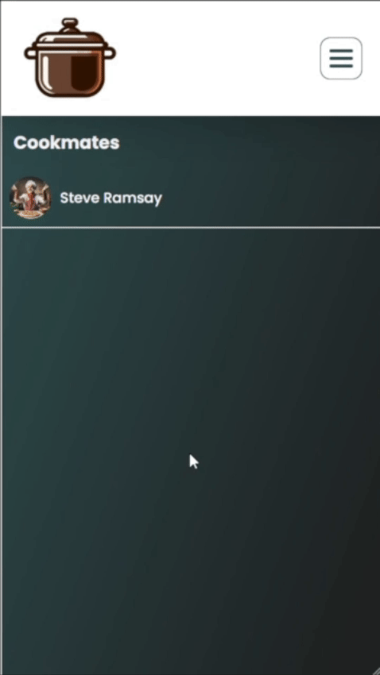

<br><br>

<!-- project philosophy -->


> Tabkhetna.
>
> A social media platform designed for food and cooking enthusiasts is a specialized online community that brings together individuals who share a common passion for all things related to food. This platform aims to create a space where users can connect, interact, and engage with others who have a similar interest in culinary arts, gastronomy, and the joy of cooking.

### User Stories

#### User

- As a user, I want to to share my recipes to everyone.
- As a user, I want to to gain more achievements to grab much more attention.
- As a user, I want to chat with others.
- As a user, I want to share my comments on other recipes.
- As a user, I want to contact for help.

<br>

<!-- Prototyping -->


> I designed Tabkhetna using wireframes and mockups, iterating on the design until we reached the ideal layout for easy navigation and a seamless user experience, I've gone during the coding process through some changes, so it might look a bit different in the app(in a better way).


### Mockups


| Login Screen  | Profile Screen | Cookmates Screen |
| ---| ---| ---|
|  |  |  
<br><br>

<!-- Tech stack -->


### Tabkhetna is built using the following technologies:
- Frontend:
  - React (Typescript)
- Backend:
  - Node.js: A Javascript runtime for executing server-side code.
  - Express: A web application framework for Node.js.
  - MongoDB: A NoSQL database for storing and managing app data.


<br><br>


<!-- Implementation -->


> Using the wireframes and mockups as a guide, we implemented the Tabkhetna app with the following features:

### User Screens (Web)

| Login screen  | Register screen |
| ---| ---|
|  |  |
| Home screen  | Challenges screen |
|  |  |
| Loading screen | Login & Register animation
|  | 

<br><br>

### User Screens (Mobile)

| Login screen  | Header screen |
| ---| ---|
|  |  |
| Chat screen  | Profile screen |
|  |  
| Challenges Screen | Home Screen
|  | 

<!-- Prompt Engineering -->


### Crafting words for better recipes with Gemini AI

- In my project, I made sure that AI understands and respond better. By choosing words carefully, I help the AI give you the right recipe info when you use Gemini AI. It's like telling it exactly what you want, and I do that to make it work better for you.
- AI would respond with either the missing ingredients or instructions for the chosen recipe post.

- The prompt: 
```bash
 As a food chef, generate a basic set of instructions for a ${title} with the provided ${currentInfo}. Please provide clear and concise steps, avoiding additional phrases and don't generate any ${currentInfo}, just generate the ${missing}. Don't make it as a vertical list, use a dash '-' to seperate each ${missing}, so only use dash characters whenever you need to separate each item. Omit numbers, and if you want to a dash character in a sentence, use space instead, in example don't write for example 12-inch write it instead 12 inch. Format the instructions as follows: (${missing} -${missing}- ...). Keep it within 300 characters. I repeat dashes are only written when item seperation is needed. Here's the ${currentInfo} list: ${listOfCurrentInfo}
```
| AI going in action  |
| -- |
  | 


<br><br>
<!-- AWS Deployment -->


###   AWS deploying:

- This project backend is hosted on an AWS EC2 server, ensuring reliable and scalable deployment. Here's my server ip address 13.39.86.160, check it out.

## Connecting to EC2 instance via SSH

1. Open your terminal on your local machine.

2. Use the following command to connect to your EC2 instance. Replace `your-instance-ip` with your actual EC2 instance's public IP address:

    ```bash
    ssh -i /path/to/your/private-key-file.pem ec2-user@your-instance-ip
    ```

## Installing Git, Node, NPM, and MongoDB

3. Update the system:

    ```bash
    sudo yum update -y
    ```

5. Install Git:

    ```bash
    sudo yum install git -y
    ```

6. Install Node.js and NPM:

    ```bash
    sudo yum install nodejs -y
    ```

7. Install and configuring MongoDB:
    - **Installation**:
      - create a new file:
        
      ```bash
        sudo vi /etc/yum.repos.d/mongodb-org-7.0.repo
      ```

      - copy/paste the following content into the created file:
      ```bash
      sudo tee /etc/yum.repos.d/mongodb-org-4.4.repo << EOF
      [mongodb-org-4.4]
      name=MongoDB Repository
      baseurl=https://repo.mongodb.org/yum/amazon/2/mongodb-org/4.4/x86_64/
      gpgcheck=1
      enabled=1
      gpgkey=https://www.mongodb.org/static/pgp/server-4.4.asc
      EOF

      sudo yum install -y mongodb-org
      sudo service mongod start
      ```

- **MongoDB Configuration:**
  - open mongo configuration file:
    ```bash
    sudo vi /etc/mongod.conf
    ```
  -  change the bindIp to 0.0.0.0  to bind to all IPv4 and IPv6 addresses.
      ```bash
      # network interfaces
        net:
          port: 27017
          bindIp: 0.0.0.0  # <--- change here
      ```
  - save and exit.
- **start the mongod service**
  ```bash
  sudo service mongod start
  ```

- **check mongod service status**
  ```bash 
  sudo service mongod status
  ```
  You should have a active(running) status by now:
  ```bash
   mongod.service - MongoDB Database Server
     Loaded: loaded (/usr/lib/systemd/system/mongod.service; enabled; preset: d>
     Active: active (running) since Wed 2024-01-24 12:04:09 UTC; 5 days ago
       Docs: https://docs.mongodb.org/manual
   Main PID: 2618 (mongod)
     Memory: 116.4M
        CPU: 32min 49.962s
     CGroup: /system.slice/mongod.service
  ```
  > If mongod service is failing, check this fix [here](https://stackoverflow.com/questions/9884233/mongodb-service-is-not-starting-up)

<br><br>

<!-- Unit Testing -->


- In this project, I tested my APIs to make sure my code works well. I checked each part of the software step by step, found and fixed problems early on. For testing my Node.js app, I used Jest and SuperTest. Here's a snapshot from my testing: 


<br><br>


<!-- How to run -->


### Prerequisites

This is an example of how to list things you need to use the software and how to install them.
* npm
  ```sh
  npm install npm@latest -g
  ```

### Installation

1. Get a free Gemini API Key at [Gemini](https://www.gemini.com/).
2. Clone the repository:

    ```bash
    git clone https://github.com/RawadAbdallah/Tabkhetna.git
    ```

3. Install NPM packages:

    ```bash
    npm install
    ```

4. Copy `.example.env` and fill in the required information:
    - Frontend environments (Inside the client/web folder):
      ```js
      //client/web/.example.env
      VITE_SERVER_URL = YOUR SERVER URL
      VITE_APP_BASE_URL = YOUR APP BASE URL
      ```
    - Backend environments (Inside the server folder):
      ```js
      //server/.example.env
      PORT = YOUR PORT
      IP = YOUR IP HERE
      GEMENI_API_KEY = ENTER API KEY 
      MONGODB_URL = "mongodb://YOUR_IP_HERE:27017/tabkhetna"
      JWT_SECRET = SECRET KEY
      ```
5. Run the frontend app:
   ```bash
   npm run dev
   ```
6. Run the backend app:
   ```bash
   npm start
   ```


Now, you are good to go and be able to run the Express app locally.
